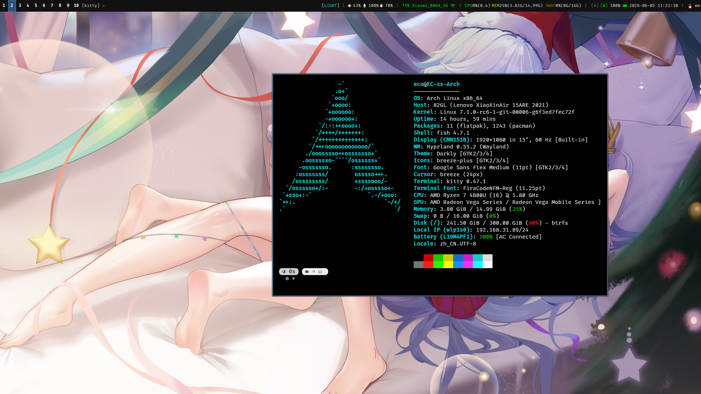

# WARNINGS

As AUR is suffering from various attacks in June (like `Atomic Arch`), **I do not recommend you to use all features this dotfile** right now, as some of its (optional) dependencies are in AUR and you have to build them (e.g. wlogout)

# Hyperway

Hyperway is a set of dots that is used by 0xarch for Hyprland WM on Archlinux.

The main keybinding is inspired by [illogical-impulse](https://github.com/end-4/dots-hyprland).

If you want this too:
  * Clone this repository.
  * Make & install package `packages/hyperway-meta`. (This provides you the default apps and Hyprland itself)
  * Run `./generate`. (This compiles two tiny C programs which replaces the original `hyprland/workspaces` widget for Waybar)
  * Link `dots/hypr/hyperway` to `~/.config/hypr/hyperway`
  * Require `hyperway.main` in your `hyprland.lua` configuration file.

## Functions

Basically, after you did a simple setup with nothing modified, you can get only 10(*3) registered workspace keybindings, 4 autorun apps (with default profile), they are:
  * `SUPER + $i`: go to workspace `i` (i=1..10, 10=Key 0)
  * `SUPER + SHIFT + $i`: bring the current window to workspace `i` with focus (i=1..10, 10=Key 0)
  * `SUPER + ALT + $i`: bring the current window to workspace `i` (i=1..10, 10=Key 0)
  * waybar, swayosd, mako, swaybg

The rest functions requires you to manually enable it by setting the environment variables to `1` and some requires other executables:
  * `HYPERWAY_EXE_DEFAULT`: Set up the default startup applications. Most of these applications (except `fcitx5`) is dependencies of `hyperway-meta`.
  * `HYPERWAY_INPUT_KEYBOARD`: Apply a set of tweaks to your keyboard.
  * `HYPERWAY_INPUT_TOUCHPAD`: Apply a set of tweaks to your touchpad.
  * `HYPERWAY_KEYBIND_BASICAPP`: Apply a set of keybinds to launch the specific applications. They are dependencies of `hyperway-keybind-basicapp` package.
  * `HYPERWAY_KEYBIND_CONTROL`: Apply a set of keybinds providing basic window management.
  * `HYPERWAY_KEYBIND_DEVICE`: Apply a set of keybinds providing basic device controlling (e.g. speaker and backlight).
  * `HYPERWAY_KEYBIND_SUGGESTAPP`: Apply a set of keybinds to launch the suggested applications. They are dependencies of `hyperway-keybind-suggest-app` package.
  * `HYPERWAY_KEYBIND_UTIL`: Apply a set of keybinds related to look and feel but not so important.
    > Current utility binding has:
    > * `SUPER + CTRL + SHIFT + D` for toggling dark themes.
    > * `SUPER + L` for `hyprlock` (If you want, you have to manually install and configure it).
    > * `SUPEP + CTRL + <mouse wheel>` for zoom in and out.
  * `HYPERWAY_WORKSPACE_DEFAULTRULE`: Apply a set of rules.
    > * Disable blurring for all applications.
    > * Allow tearing for games and wine apps. Currently there are `.*minecraft.*` and `^(steam_app).*`.
    > * Disable animation for layer `gtk4-layer-shell`

These environment variables requires string or number, as it tells the dot how to setup the workable interface:
  * `HYPERWAY_APPEARANCE`, `HYPERWAY_APPEARANCE_*`: The interface. See [Appearance](#appearance).
  * `HYPERWAY_WORKSPACE_COUNT`: How many workspaces you want. Keybinds for `SUPER + i`, `SUPER + SHIFT + i`, `SUPER + ALT + i` will be registered. Also waybar will display persistent workspaces in this count. Defaults to 10. Max = 10 or it will cause register problems.

## Appearance

The `HYPERWAY_APPEARANCE` specifies the appearance. It has to be set before you include Hyperway in your configuration file.

For now you can choose:
  * [`swaylike`](#swaylike): Clean SwayWM-like interface, with tweaked quick animations.
  * [`swaypure`](#swaypure): Almost a sway copy in Hyprland.

The default (unspecified or not included above) brings you the default configuration of a minimum DE deps: `waybar`, `swayosd`, `mako`. They are using the copied default files.

`HYPERWAY_APPEARANCE_WALLPAPER_LIGHT` and `HYPERWAY_APPEARANCE_WALLPAPER_DARK` specifies the wallpaper you want. No wallpaper will be used if not specified. Switching is automatically done through darkmode utils.

### Swaylike



Style set included the original sway colors (#285577, #4C7899) in almost all components. No rounded corner, very less animation, blur should be manually enabled in specific rules.

It's designed for doing work in a efficient way, not capturing pictures and swinging around. All information you need is on the top bar.

This theme also contains a environment compatibility fix to Qt apps to make sure they use the correct theme.

Suggested packages to install: `ttf-firacode-nerd`

The default bar setup:
```
Left: (ltr)
<Workspaces> [<windowClass>] <windowTitle>
Right: (ltr)
<SystemColorMode> | <OutputVolume> <InputVolume> <BackLight> | <signalStrength> <connectName> <connectTypeIcon> | CPU<cpuUsage>(<cpuLoad>) MEM<memUsage>(<memUsed>/<memTotal>)+<swapUsage>(<swapUsed>/<swapTotal>) | <capsLockIndicator><numLockIndicator> <batteryPercent><batteryStatIcon> <dateTime> | <trays>

(The 'CPU' and 'MEM' label's colors change along with usage. Low usage = green, High usage = red, also yellow, orange etc.)
```

### Swaypure

Style set with sway colors, without any effects. Designed for geeks. Raw Sway Flavour.

If you were just make the decision to move to Hyprland from Sway, this should give you the same feel. No animation, no blur, no decorations.

This theme also contains a environment compatibility fix to Qt apps to make sure they use the correct theme.

The default bar is a `i3status` like displaying. Left is workspace, right is a simulation of default `i3status` config.

## Packages

You can find these packages in `packages` directory.

The `hyperway-meta` contains:
  * mako (autostart)
  * hyprland (start by greet daemons)
  * waybar (autostart)
  * swayosd (autostart)
  * xdg-desktop-portal-hyprland (autostart)
  * swaybg (Used in darkmode utils, for Wallpaper displaying)
  * bc (Used to calculate things in scripts)
  * jq (Used to calculate things in scripts)

The `hyperway-keybind-basicapp` contains:
  * hyprpicker (`SUPER + SHIFT + C`)
  * kitty (`SUPER + Return`)
  * fuzzel (`SUPER`)
  * hyprshot (`SUPER + SHIFT + S` (region), `Print` (screen))
  * wlogout (`SUPER + SHIFT + E`)

The `hyperway-keybind-suggest-app` contains:
  * dolphin (`SUPER + E`)
  * chromium (`SUPER + W`)
  * pavucontrol-qt (`SUPER + M`)
  * cliphist (`SUPER + V`, works along with fuzzel)
  * plasma-workspace (optionally used in darkmode utils, for Qt apps)
  * wf-recorder (`SUPER + SHIFT + R`)

There are also optional packages:
  * `hyperway-kde` and `hyperway-kde-app` provide you useful tools maintained by KDE.
  * `hyperway-lnf` provides you essential things to make your workspace (looks) more powerful.

## Extra Providing

There's also hyprlock and fuzzel configuration file. Both contain a simple, quick interface. You can copy or link.

## NO CONTRIBUTION

This is the dot that SUIT MY WORKFLOW and I did as much modulizing as I can. You can copy any of these files to your own dotfile.

All configuration files (Without the README and images) is CC-0 (Copyleft).
